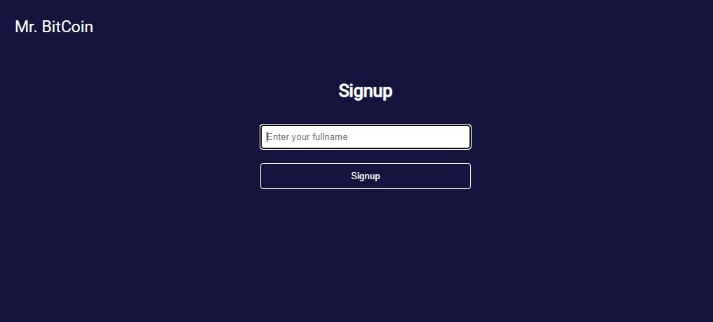
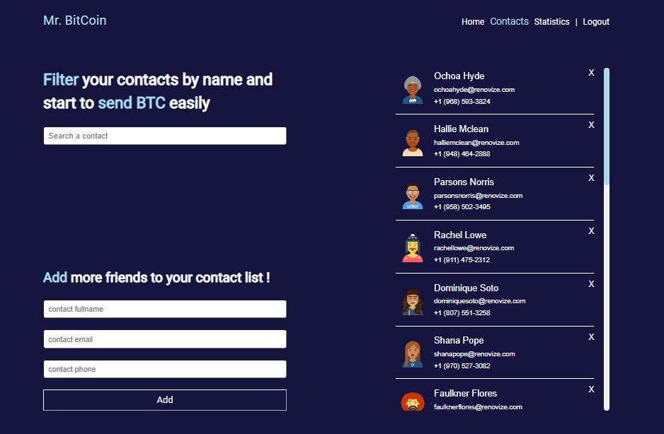

# Mr.BitCoin
An app I wrote with Angular, in which you can transfer money to your fake contacts, CRUDL them and get information about the current Bitcoin value, the market price and more!
[Take a look, it's on Github pages](https://talelmaliachhemo.github.io/bitcoin-angular/#/)


___

### Table of Contents
- [Description](#description)
- [Features](#features)
- [Getting started](#getting-started)
- [Showcase](#showcase)

## Description
I decided to learn a new framework, because I want to keep expanding my knowladge and try new challenges. That was **my motivation.** 

A bit about the project - a small App that was built in a few days, which provides the user a list of contacts that they can transfer money to, a basic CRUDL and some information about the value of their fake bank currency in Bitcoin.

You are more than welcome to ***check it out***. Just enter your name and see it yourself - [right here](https://talelmaliachhemo.github.io/bitcoin-angular/#/)


#### Technologies

- Angular
- TypeScript
- Angular-Router
- Rxjs
- Ng2-charts
- Sass
- Angular CLI & Github pages

## Features
Please feel free to take a look of the different components of the website - [Showcase](#showcase)

- Simple authentication - local storage.
- HTTP request for Market price, Bitcoin rate and more.
- Presenting data in a dashboard using charts & 3rd side library.
- CRUDL of contacts, along with User messages for different actions.
- Responsive and well designed.


## Getting started
Clone the project or dowload the files on top.
```
git clone https://github.com/TalElmaliachHemo/bitcoin-angular.git
```
Open the terminal and enter the following line to run it locally on your computer:
```
npm start 
```
Runs the app in the development mode.
Open http://localhost:4200 to view it in the browser.

## Showcase

### Sign-up page



### Your contacts
You can view your different contacts, filter them by name, and also add a new one to your list.
In addition, you can transfer money, randomly, to one of your contacts by pressing on them and click on the "transfer" button.




### Some mobile!
Just a taste of the mobile experience. I used different **mixins**, **conditional rendering**, and the **"mobile first"** approach. 
You can also see that there is an interactive **menu** for routing.


<!-- ### Dashboard
Here I present some of the user bank details, with charts about USD exchange trade value over the years, the Market place and their latest moves.

 -->
